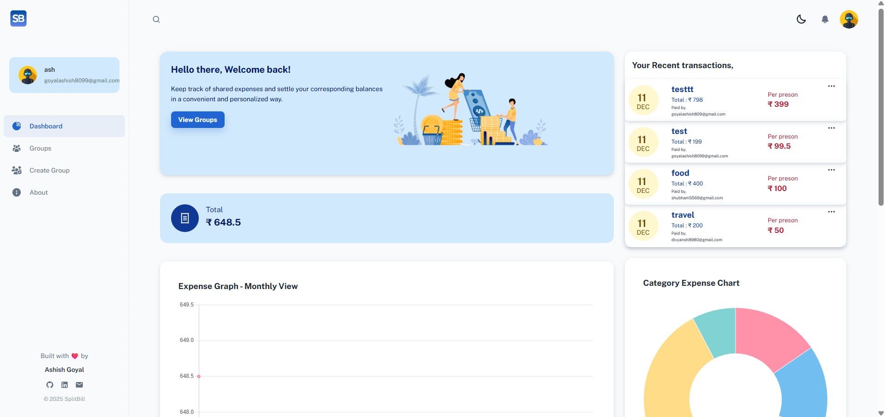
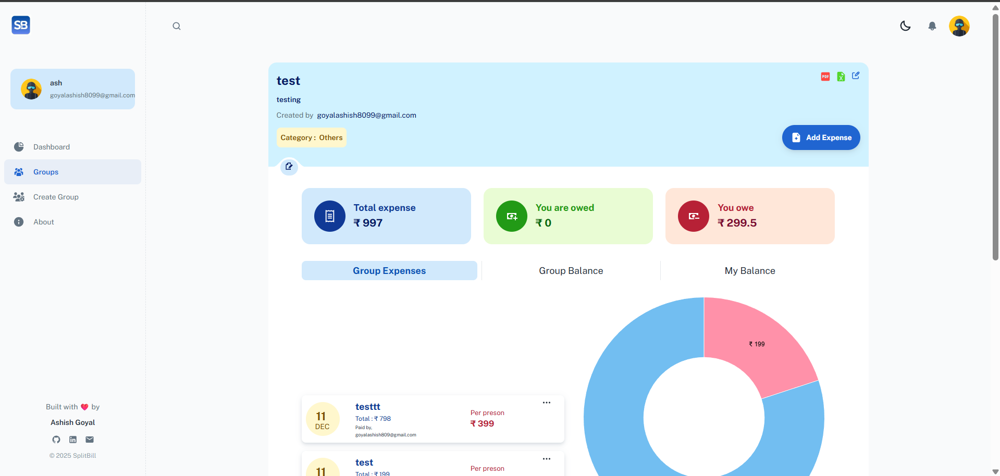
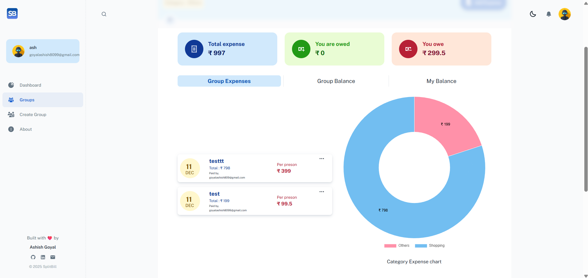
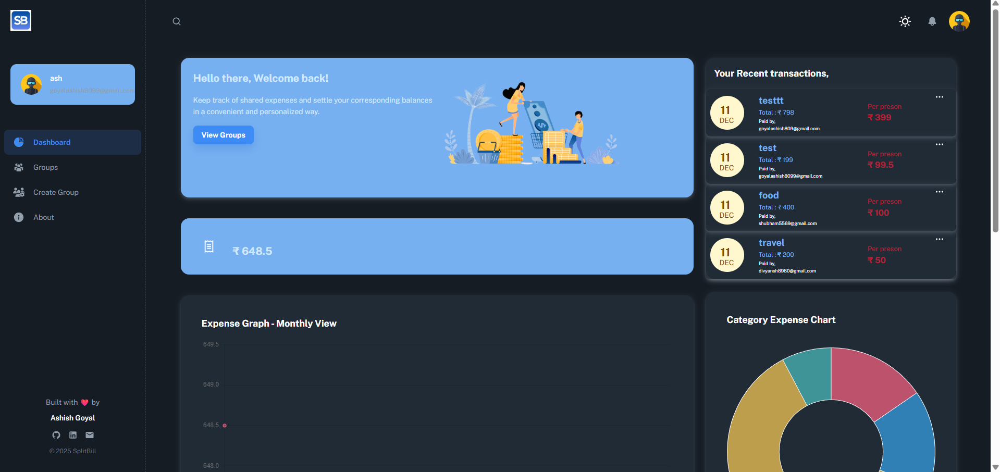
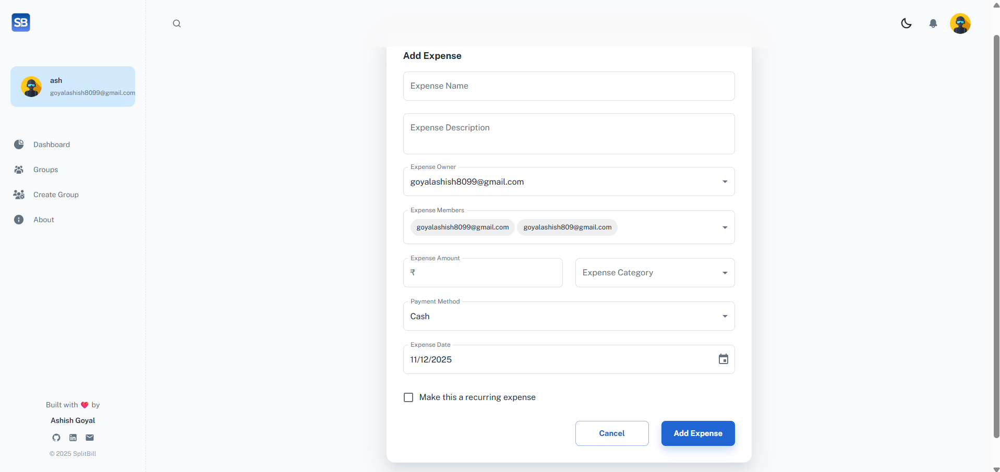

# 💰 SplitBill

A powerful real-time full-stack MERN app for smart group expense tracking, optimized debt settlement, activity audit trails, searchable expenses, exportable reports, instant WebSocket sync, and insightful analytics.

[](https://splitbill-7p1s.onrender.com)
[](https://github.com/ashish-goyal-1/SplitBill)
[](https://www.linkedin.com/in/ashish-goyal-66422b257/)

> 🌐 **Live Demo**: [https://splitbill-7p1s.onrender.com](https://splitbill-7p1s.onrender.com)

---

## 📑 Table of Contents

- [Features](#-features)
- [Algorithm Details](#-algorithm-details)
- [Tech Stack](#-tech-stack)
- [Screenshots](#-screenshots)
- [Installation](#-installation--setup)
- [API Endpoints](#-api-endpoints)
- [Environment Variables](#-environment-variables)
- [Testing](#-testing)
- [Author](#-author)

---

## ✨ Features

### 🔐 Authentication & Security
- Secure login & registration with **JWT dual-token system**
- **Access Token** (15 min) + **Refresh Token** (7 days) with rotation
- Encrypted passwords (bcryptjs)
- Profile view/edit with Gravatar support
- Automatic token refresh for seamless UX

### 👥 Group Management
- Create/edit/delete groups
- **Privacy-Focused Member Search**: Search by email only (strangers can't be found by name)
- **Pending Invite System**: Strangers must accept invite; recent contacts are added directly
- **Non-User Invites**: Send email invitations to people not yet on SplitBill
- Multiple currencies supported (INR, USD, EUR)
- Group categories: Trip, Home, Couple, etc.

### 💸 Expense Tracking
- Add/edit/delete group expenses
- Categorize and filter by type/date
- **Three Split Types Supported:**
  - ⚖️ **Equal Split**: Auto-divide expense equally among members
  - 💵 **Exact Amount**: Specify precise amounts each person owes
  - 📊 **Percentage Split**: Define percentages per person (e.g., 50%, 30%, 20%)
- Recurring options: daily/weekly/monthly/yearly

### 💰 Settlements & Smart Splitting
- **Hybrid O(N log N) Algorithm** for optimal debt simplification:
  - **Step 1**: O(N) Hash-based exact match heuristic
  - **Step 2**: O(N log N) Sorted two-pointer greedy
- Minimizes number of transactions between group members
- Balance view (who owes whom)
- Record settlements and payment methods

### 📧 Email System
- Manual nudges for unsettled balances
- Daily automatic reminders via node-cron
- Settlement confirmation notifications

### 📊 Analytics & Dashboard
- **MongoDB Aggregation Pipelines** for real-time analytics
- Category-wise expense breakdown
- Monthly spending trends
- Top spenders in group
- Daily spending breakdown
- Dashboard widgets for quick overview

### 🔔 Real-Time Updates & Notifications
- **Socket.io WebSocket** for instant expense updates
- Real-time sync when group members add/edit/delete expenses
- In-app notifications with unread badge
- Automatic UI refresh without page reload

### 📤 Export Reports
- 📄 Export to PDF: Full group expense report
- 📊 Export to CSV: All group data as spreadsheet

### ⚡ Performance Optimizations
- **Gzip Compression**: ~70% reduction in response size
- **Code Splitting**: React.lazy() for route-based chunking
- **Service Worker Caching**: PWA with offline support
- Lazy loaded routes & optimized bundle

### 🧪 Testing
- **Jest Unit Tests** for algorithm validation
- 15+ test cases covering correctness, edge cases, and performance
- Run tests: `npm test`

### 🎨 UI/UX Enhancements
- Material UI theming (dark/light toggle)
- **PWA installable** on mobile & desktop
- Custom icons & smooth animations
- Empty-state illustrations for cleaner UI

### 🆕 Latest Features (v2.0)

#### 📝 Activity Feed (Audit Trail)
- **Complete history** of all group actions
- Tracks: expense add/edit/delete, settlements, member joins
- Timeline view with relative timestamps
- Answers "Who deleted that expense?"

#### 🔍 Search & Filter
- **Instant search** expenses by name/description
- **Filter by category**: Food, Transport, Entertainment, etc.
- **Filter by payer**: See only specific member's expenses
- Client-side filtering for instant results

#### 🏠 Dashboard Redesign (Action-First)
- **3-Zone Layout**:
  - Zone 1 (Status): Simple greeting + Balance cards at top
  - Zone 2 (Navigation): Compact Group Cards + Recent transactions
  - Zone 3 (Analytics): All charts consolidated (Spending by Group, Category, Monthly)
- **Compact Group Cards**: Clickable grid with name, member count, category tag
- **Removed Hero Banner**: Clean, action-focused interface

#### 💱 Multi-Currency Balance Cards
- **Smart Currency Grouping**: Debts aggregated by currency (no mixing ₹ + $)
- **Single currency**: Big number display (₹ 1,200)
- **Multiple currencies**: Vertical list (₹ 1,200, $ 25, € 10)
- **3+ currencies**: Scrollable list with max height
- Uses `currencyFind()` helper for symbols (₹, $, €, £, ¥)

#### ⚡ Global Quick Add
- **Floating Action Button (FAB)** on dashboard
- One-click expense creation from anywhere
- Group selector → Dynamic member loading
- No need to navigate into specific group first

#### 🔗 Share Group
- **Share button** in group header
- Copies group link to clipboard
- Tooltip: "Copy invite link"
- Snackbar feedback confirmation

#### 📊 View Group Layout Cleanup
- **Summary Ribbon**: Total Spend + Your Share at top
- Sticky on desktop, scrollable on mobile
- **Expenses Tab**: Clean ledger (expenses only)
- **Balance Tab**: Analytics hub (charts moved here)

#### 🔐 Email Verification & Password Reset
- Email verification on registration
- Secure password reset flow
- Token-based verification (15 min expiry)

---

## 🧮 Algorithm Details

### Hybrid Debt Settlement Algorithm

The settlement algorithm uses a **two-step hybrid approach** to minimize transactions:

```
┌─────────────────────────────────────────────────────────────┐
│  Input: { Alice: +50, Bob: -30, Charlie: -20, Dave: +30 }   │
└─────────────────────────────────────────────────────────────┘
                              │
                              ▼
┌─────────────────────────────────────────────────────────────┐
│  STEP 1: Hash-based Exact Match [O(N)]                      │
│  ─────────────────────────────────────────                  │
│  • Build Map of {amount → person}                           │
│  • Find pairs: Bob(-30) ↔ Dave(+30) ✓ Exact match!          │
│  • Settlement: Bob pays Dave $30                            │
└─────────────────────────────────────────────────────────────┘
                              │
                              ▼
┌─────────────────────────────────────────────────────────────┐
│  STEP 2: Sorted Two-Pointer [O(N log N)]                    │
│  ────────────────────────────────────────                   │
│  • Remaining: Alice(+50), Charlie(-20)                      │
│  • Sort creditors & debtors                                 │
│  • Match using two pointers                                 │
│  • Settlement: Charlie pays Alice $20                       │
└─────────────────────────────────────────────────────────────┘
                              │
                              ▼
┌─────────────────────────────────────────────────────────────┐
│  Output: [ [Bob, Dave, 30], [Charlie, Alice, 20] ]          │
│  Total Complexity: O(N log N)                               │
└─────────────────────────────────────────────────────────────┘
```

| Step | Complexity | Technique |
|------|------------|-----------|
| Exact Match | O(N) | Hash Map lookup |
| Sorting | O(N log N) | JavaScript TimSort |
| Two-Pointer | O(N) | Greedy matching |
| **Total** | **O(N log N)** | Hybrid approach |

---

## 🛠️ Tech Stack

### Frontend
- React.js (with React Router)
- Material UI & Emotion
- **Socket.io-client** for real-time WebSocket
- Axios, Formik, Yup
- Chart.js via react-chartjs-2
- Iconify & Simplebar
- Gravatar, React Context API
- **Service Worker** for PWA

### Backend
- Node.js + Express.js
- **Socket.io** for real-time WebSocket communication
- MongoDB Atlas via Mongoose
- **MongoDB Aggregation Pipelines** for analytics
- JWT authentication with **Refresh Token Rotation**
- bcryptjs for password encryption
- **Gzip Compression** via compression middleware
- Nodemailer (Gmail SMTP)
- node-cron for scheduling
- Winston for structured logging

### DevOps & Deployment
- Environment config via dotenv
- MongoDB Atlas cloud database
- Concurrently for dev scripts
- **PWA optimized** with Service Worker caching

---

## 📡 API Endpoints

### 🔐 Authentication
| Endpoint | Method | Description |
|----------|--------|-------------|
| `/api/users/v1/register` | POST | Register new user |
| `/api/users/v1/login` | POST | Login (returns access + refresh tokens) |
| `/api/users/v1/refresh` | POST | Refresh access token |
| `/api/users/v1/logout` | POST | Invalidate refresh token |
| `/api/users/v1/view` | POST | View user profile |
| `/api/users/v1/edit` | POST | Update user profile |
| `/api/users/v1/updatePassword` | POST | Change password |
| `/api/users/v1/delete` | DELETE | Delete user account |

### 👥 Groups
| Endpoint | Method | Description |
|----------|--------|-------------|
| `/api/group/v1/add` | POST | Create new group |
| `/api/group/v1/view` | POST | View group details |
| `/api/group/v1/user` | POST | Get all groups for a user |
| `/api/group/v1/edit` | POST | Update group |
| `/api/group/v1/delete` | DELETE | Delete group |

### 💸 Expenses
| Endpoint | Method | Description |
|----------|--------|-------------|
| `/api/expense/v1/add` | POST | Add expense (supports equal/exact/percentage split) |
| `/api/expense/v1/edit` | POST | Edit expense |
| `/api/expense/v1/delete` | DELETE | Delete expense |
| `/api/expense/v1/view` | POST | View single expense |
| `/api/expense/v1/group` | POST | Get all expenses for a group |
| `/api/expense/v1/user` | POST | Get all expenses for a user |
| `/api/expense/v1/user/recent` | POST | Get 5 most recent expenses |

### 💰 Settlements
| Endpoint | Method | Description |
|----------|--------|-------------|
| `/api/group/v1/settlement` | POST | Calculate group balance sheet (who owes whom) |
| `/api/group/v1/makeSettlement` | POST | Record a settlement payment |
| `/api/group/v1/consolidate` | POST | Cross-group debt consolidation |
| `/api/group/v1/nudge` | POST | Send payment reminder email |
| `/api/group/v1/pendingInvites` | POST | Get user's pending group invitations |
| `/api/group/v1/acceptInvite` | POST | Accept a group invitation |
| `/api/group/v1/declineInvite` | POST | Decline a group invitation |
| `/api/group/v1/activity` | POST | Get activity logs for a group |

### 📊 Analytics
| Endpoint | Method | Description |
|----------|--------|-------------|
| `/api/analytics/category-breakdown` | POST | Expenses by category |
| `/api/analytics/monthly-trends` | POST | Monthly spending trends |
| `/api/analytics/user-summary` | POST | User spending summary |
| `/api/analytics/top-spenders` | POST | Top spenders in group |
| `/api/analytics/daily-breakdown` | POST | Daily spending breakdown |

---

## 🔧 Environment Variables

Create a `.env` file in the root directory with the following variables:

| Variable | Required | Description |
|----------|----------|-------------|
| `PORT` | Yes | Server port (default: 3001) |
| `MONGODB_URI` | Yes | MongoDB Atlas connection string |
| `ACCESS_TOKEN_SECRET` | Yes | Secret key for JWT access tokens |
| `REFRESH_TOKEN_SECRET` | No | Secret for refresh tokens (falls back to ACCESS_TOKEN_SECRET) |
| `EMAIL_USER` | No | Gmail address for sending notifications |
| `EMAIL_PASS` | No | Gmail app password (not regular password) |
| `APP_URL` | No | Frontend URL for email links (default: http://localhost:3000) |

**Example `.env`:**
```env
PORT=3001
MONGODB_URI=mongodb+srv://<username>:<password>@<cluster>.mongodb.net/splitbill
ACCESS_TOKEN_SECRET=<your_super_secret_jwt_key_here>
REFRESH_TOKEN_SECRET=<your_refresh_token_secret>
EMAIL_USER=<your_email@gmail.com>
EMAIL_PASS=<your_gmail_app_password>
APP_URL=https://your-app-url.com
```

> **Note**: For Gmail, you need to use an [App Password](https://support.google.com/accounts/answer/185833), not your regular password.

---

## 🚀 Getting Started

### Prerequisites
- Node.js v14+
- MongoDB Atlas account
- Gmail app password for emails

### Installation

1. Clone the repository
```bash
git clone https://github.com/ashish-goyal-1/SplitBill.git
cd SplitBill
```

2. Install dependencies
```bash
npm install
cd client && npm install
```

3. Create `.env` file (see [Environment Variables](#-environment-variables) section above)

4. Start the application
```bash
npm run dev
```

- Client runs on `http://localhost:3000`
- Server runs on `http://localhost:3001`

---

## 📸 Screenshots

### Dashboard


### Group View with Export Icons


### Analytics Page


### Dark Mode Toggle


### Add Expense Dialog


---

## 👨‍💻 Developer

**Ashish Goyal**  
Full Stack Developer | MERN Enthusiast

- 🔗 GitHub: [@ashish-goyal-1](https://github.com/ashish-goyal-1)
- 💼 LinkedIn: [Ashish Goyal](https://www.linkedin.com/in/ashish-goyal-66422b257/)
