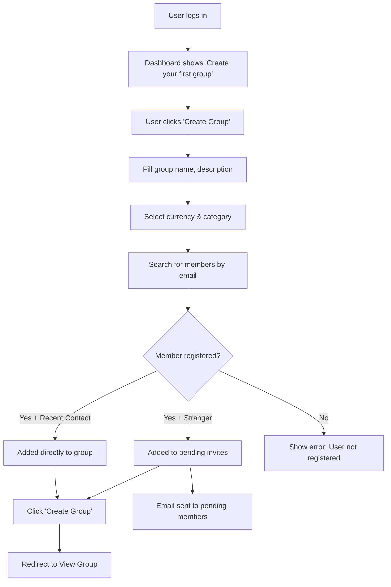
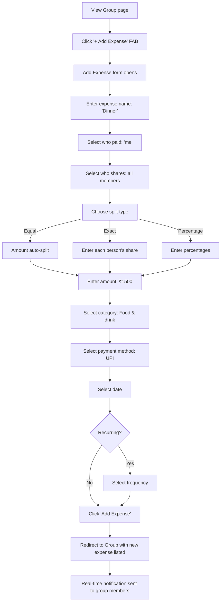
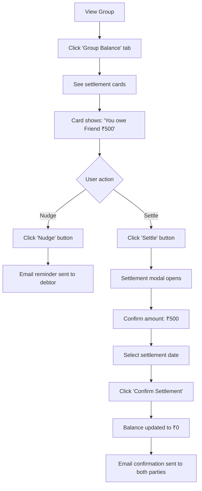

# SplitBill - Functional Specification Document
**Version:** 1.0  
**Last Updated:** December 19, 2025  
**Author:** Generated from codebase analysis

---

## 1. High-Level Overview

### Elevator Pitch
SplitBill is a **group expense management web application** that solves the common pain point of splitting bills among friends, roommates, or travel companions. Instead of manually tracking who paid for what and doing complex calculations, users can record expenses as they happen, and SplitBill automatically calculates the optimal way to settle debts—minimizing the number of transactions required.

### Target User
- **Primary:** Friend groups splitting dinner bills, roommates sharing rent/utilities, travel buddies managing trip expenses
- **Secondary:** Small teams or clubs managing shared costs
- **Demographics:** Tech-savvy users aged 18-45 comfortable with web applications

### Key Differentiating Features
| Feature | Description |
|---------|-------------|
| **Hybrid Settlement Algorithm** | O(N log N) optimized debt consolidation that minimizes the number of transactions required to settle all debts |
| **Flexible Split Types** | Equal split, exact amounts, or percentage-based splitting |
| **Multi-Currency Support** | 10+ currencies (INR, USD, EUR, GBP, etc.) with conversion |
| **Pending Invite System** | Strangers receive email invitations; recent contacts added directly |
| **Real-time Updates** | Socket.io powered live expense/settlement notifications |
| **Export Functionality** | PDF reports and CSV data export |
| **Recurring Expenses** | Auto-repeat expenses (daily/weekly/monthly/yearly) |
| **Payment Reminders** | "Nudge" feature to send email reminders for pending payments |
| **PWA Support** | Offline-capable Progressive Web App with installable experience |

---

## 2. Site Map & Navigation

### Route Structure
```
/                           → Login Page
├── /register               → Registration Page  
├── /about                  → About Page (public)
├── /forgot-password        → Password Recovery
├── /reset-password/:token  → Password Reset Form
├── /verify/:token          → Email Verification
└── /dashboard              → Authenticated Area (requires login)
    ├── /app                → Dashboard Home
    ├── /groups             → Groups List
    │   ├── /view/:groupId  → View Group Details
    │   └── /edit/:groupId  → Edit Group Settings
    ├── /crateGroup         → Create New Group
    ├── /addExpense/:groupId→ Add Expense to Group  
    ├── /editExpense/:expenseId → Edit Existing Expense
    ├── /viewExpense/:expenseId → View Expense Details
    └── /userProfile        → User Profile Settings
```

### Navigation Structure
The application uses a **sidebar + navbar** layout for authenticated pages:

#### Top Navbar (DashboardNavbar)
- **Left:** Hamburger menu (mobile only) to toggle sidebar
- **Right:** Dark/light mode toggle → Notification bell → User avatar dropdown

#### Left Sidebar (DashboardSidebar)
Persistent on desktop, drawer on mobile. Contains:
1. **User Profile Card** - Avatar + name + email
2. **Navigation Links:**
   - 📊 Dashboard
   - 👥 Groups
   - ➕ Create Group
   - ℹ️ About
3. **Footer:** "Built with ❤️ by Ashish Goyal" + social links

---

## 3. Detailed Page Breakdowns

### 3.1 Login Page (`/`)

**Page Purpose:** Authenticate existing users to access the application.

**Visual Layout:**
```
┌────────────────────────────────────────┐
│              [SB Logo]                 │
│                                        │
│         Sign in to SplitBill           │
│                                        │
│  ┌──────────────────────────────────┐  │
│  │ Email Address                    │  │
│  └──────────────────────────────────┘  │
│  ┌──────────────────────────────────┐  │
│  │ Password              [👁]       │  │
│  └──────────────────────────────────┘  │
│                                        │
│  [Forgot password?]                    │
│                                        │
│  ┌──────────────────────────────────┐  │
│  │          Sign In                 │  │
│  └──────────────────────────────────┘  │
│                                        │
│  Don't have an account? [Register]     │
└────────────────────────────────────────┘
```

**Data Displayed:** None (form inputs only)

**User Actions:**
- Enter email and password
- Toggle password visibility (eye icon)
- Click "Sign In" to authenticate
- Click "Forgot password?" to recover account
- Click "Register" to create new account

**Edge States:**
- Invalid credentials → Red error banner: "Invalid email or password"
- Unverified email → "Please verify your email before logging in"
- Network error → Generic error message

---

### 3.2 Registration Page (`/register`)

**Page Purpose:** Create a new user account with email verification.

**Visual Layout:**
```
┌────────────────────────────────────────┐
│              [SB Logo]                 │
│                                        │
│       Create your SplitBill account    │
│                                        │
│  ┌──────────────────────────────────┐  │
│  │ First Name                       │  │
│  └──────────────────────────────────┘  │
│  ┌──────────────────────────────────┐  │
│  │ Last Name                        │  │
│  └──────────────────────────────────┘  │
│  ┌──────────────────────────────────┐  │
│  │ Email Address                    │  │
│  └──────────────────────────────────┘  │
│  ┌──────────────────────────────────┐  │
│  │ Password              [👁]       │  │
│  └──────────────────────────────────┘  │
│                                        │
│  ┌──────────────────────────────────┐  │
│  │         Create Account           │  │
│  └──────────────────────────────────┘  │
│                                        │
│  Already have an account? [Sign in]    │
└────────────────────────────────────────┘
```

**Validation Rules:**
- First name: Required, 2-20 characters
- Last name: Optional
- Email: Required, valid email format, unique
- Password: Required, minimum 8 characters

**Post-Registration:**
Shows success message: "Registration successful! Please check your email to verify your account."

---

### 3.3 Dashboard (`/dashboard/app`)

**Page Purpose:** Central hub showing expense overview, pending invites, and recent activity.

**Visual Layout:**
```
┌─────────────────────────────────────────────────────────────┐
│ [Sidebar]  │                                                │
│            │  Welcome back, Ashish! 👋                      │
│ Dashboard  │                                                │
│ Groups     │  ┌─ Pending Group Invitations ──────────────┐  │
│ Create     │  │ 🎉 John invited you to "Trip to Goa"     │  │
│ About      │  │ [Accept] [Decline]                       │  │
│            │  └──────────────────────────────────────────┘  │
│            │                                                │
│            │  ┌────────────┐ ┌────────────┐ ┌────────────┐  │
│            │  │ Total Exp  │ │ You're Owed│ │ You Owe    │  │
│            │  │  ₹15,000   │ │   ₹2,500   │ │   ₹800     │  │
│            │  └────────────┘ └────────────┘ └────────────┘  │
│            │                                                │
│            │  ┌─ Expense Trends ─────────────────────────┐  │
│            │  │ [Daily ▼]  📈 Line chart over 30 days    │  │
│            │  └──────────────────────────────────────────┘  │
│            │                                                │
│            │  ┌─ Recent    ─┐  ┌─ Category Breakdown ────┐  │
│            │  │ Transactions│  │ 🍕 Food: 40%            │  │
│            │  │ • Dinner ₹500│ │ 🚗 Transport: 25%       │  │
│            │  │ • Uber ₹200 │  │ 🏠 Home: 20%            │  │
│            │  │ • Groceries │  │ 🎮 Entertainment: 15%   │  │
│            │  └─────────────┘  └──────────────────────────┘  │
└─────────────────────────────────────────────────────────────┘
```

**Components:**

| Component | Description |
|-----------|-------------|
| **WelcomeMessage** | Personalized greeting with user's first name |
| **PendingInvites** | Card list of groups user is invited to (accept/decline) |
| **SummaryCards** | Three stat cards: Total expenses, Amount owed to you, Amount you owe |
| **CalenderExpenseGraph** | Line chart with daily/monthly toggle showing expense trends |
| **GroupExpenseChart** | Bar chart comparing expenses across groups |
| **CategoryExpenseChart** | Doughnut chart showing category breakdown |
| **RecentTransactions** | List of last 5 expenses with name, amount, group |

**User Actions:**
- Accept/Decline pending group invitations
- Toggle Daily/Monthly view on expense graph
- Click recent transaction to view details
- Navigate via sidebar to other pages

**Edge States:**
- New user (no groups) → Shows "Create your first group" prompt
- No pending invites → Section hidden
- No expenses → Charts show empty state

---

### 3.4 Groups List (`/dashboard/groups`)

**Page Purpose:** View all groups the user is a member of.

**Visual Layout:**
```
┌─────────────────────────────────────────────────────────────┐
│                      Your Groups                            │
│                                                             │
│  ┌─────────────────────┐  ┌─────────────────────┐          │
│  │ 🏠 Roommates        │  │ ✈️ Goa Trip         │          │
│  │ 3 members           │  │ 5 members           │          │
│  │ Total: ₹45,000      │  │ Total: ₹28,000      │          │
│  │ Your share: ₹15,000 │  │ Your share: ₹5,600  │          │
│  │ [View Group]        │  │ [View Group]        │          │
│  └─────────────────────┘  └─────────────────────┘          │
│                                                             │
│  ┌─────────────────────┐  ┌─────────────────────┐          │
│  │ 🍕 Office Lunch     │  │ + Create Group      │          │
│  │ 8 members           │  │                     │          │
│  │ Total: ₹12,000      │  │                     │          │
│  └─────────────────────┘  └─────────────────────┘          │
└─────────────────────────────────────────────────────────────┘
```

**Data Displayed per Card:**
- Category icon (Home, Trip, Couple, etc.)
- Group name
- Member count
- Group total expenses
- User's share of expenses
- Currency symbol

**User Actions:**
- Click card → Navigate to View Group
- Click "Create Group" card → Navigate to Create Group

**Edge States:**
- No groups → "No groups yet. Create your first group!"

---

### 3.5 Create Group (`/dashboard/crateGroup`)

**Page Purpose:** Create a new expense-sharing group and invite members.

**Visual Layout:**
```
┌─────────────────────────────────────────────────────────────┐
│                     Create New Group                        │
│                                                             │
│  ┌──────────────────────────────────────────────────────┐  │
│  │ Group Name *                                          │  │
│  └──────────────────────────────────────────────────────┘  │
│  ┌──────────────────────────────────────────────────────┐  │
│  │ Group Description                                     │  │
│  │ (textarea)                                            │  │
│  └──────────────────────────────────────────────────────┘  │
│                                                             │
│  Currency *        Group Category *                         │
│  ┌────────────┐    ┌────────────────┐                      │
│  │ INR (₹)  ▼│    │ Home        ▼│                      │
│  └────────────┘    └────────────────┘                      │
│                                                             │
│  Group Members                                              │
│  ┌──────────────────────────────────────────────────────┐  │
│  │ [🟢 you@email.com ✕] [🔵 friend@email.com ✕]         │  │
│  └──────────────────────────────────────────────────────┘  │
│  ┌──────────────────────────────────────────────────────┐  │
│  │ 🔍 Search by email or name (min 3 chars)...          │  │
│  └──────────────────────────────────────────────────────┘  │
│                                                             │
│  🔴 RECENT CONTACTS                                         │
│  ┌──────────────────────────────────────────────────────┐  │
│  │ [a] friend@email.com    from "Previous Group"        │  │
│  └──────────────────────────────────────────────────────┘  │
│                                                             │
│  [Cancel]                              [Create Group]       │
└─────────────────────────────────────────────────────────────┘
```

**Form Fields:**

| Field | Type | Required | Validation |
|-------|------|----------|------------|
| Group Name | Text | Yes | Non-empty |
| Description | Textarea | No | Max 100 chars |
| Currency | Dropdown | Yes | INR, USD, EUR, GBP, etc. |
| Category | Dropdown | Yes | Home, Trip, Couple, Sports, Others |
| Members | Multi-select chips | No | Valid registered emails |

**Member Search Behavior:**
- Type 3+ characters to search
- Shows registered users matching query
- "Recent Contacts" section shows people from previous groups
- Click to add member as chip
- Click ✕ on chip to remove

**Invite Logic:**
- **Recent contacts:** Added directly to group
- **Strangers:** Added to pending invites + receive email invitation

**User Actions:**
- Fill form fields
- Search and add members
- Remove members by clicking ✕
- Submit form to create group

---

### 3.6 View Group (`/dashboard/groups/view/:groupId`)

**Page Purpose:** View group details, expenses, balances, and manage settlements.

**Visual Layout:**
```
┌─────────────────────────────────────────────────────────────┐
│                                          [PDF][CSV][Edit✏️] │
│  📊 nandi trip                                              │
│  nandi trip bills                                           │
│  Created by: goyalashish809@gmail.com                       │
│  ┌Category: Trip ──┐                          [+ Add Expense]│
│                                                             │
│  👥 Members (3)                                             │
│  [🔵 ashish] [🔵 22cs3018] [🟡 goyalashish8099 ⏳]          │
│                                                             │
│  ┌────────────┐ ┌────────────┐ ┌────────────┐              │
│  │ Total Exp  │ │ You're Owed│ │ You Owe    │              │
│  │  ₹750      │ │   ₹150     │ │   ₹0       │              │
│  └────────────┘ └────────────┘ └────────────┘              │
│                                                             │
│  ┌──────────────────────────────────────────────────────┐  │
│  │ [Group Expenses]  [Group Balance]  [My Balance]      │  │
│  └──────────────────────────────────────────────────────┘  │
│                                                             │
│  ══════════════════════════════════════════════════════════│
│  │ EXPENSE TAB VIEW                                      │  │
│  │                                                        │  │
│  │ ┌─ food ─────────────────────────────────────────┐    │  │
│  │ │ Paid by: you@email.com    12/19/2025   ₹350    │    │  │
│  │ │ Split among: 3 members                  [Edit] │    │  │
│  │ └─────────────────────────────────────────────────┘    │  │
│  │                                                        │  │
│  │ ┌─ fuel ─────────────────────────────────────────┐    │  │
│  │ │ Paid by: friend@email.com 12/19/2025   ₹400    │    │  │
│  │ │ Split among: 3 members                  [Edit] │    │  │
│  │ └─────────────────────────────────────────────────┘    │  │
│  │                                                        │  │
│  │ [Show More]                                            │  │
│  ══════════════════════════════════════════════════════════│
│                                                             │
│  ┌─ Top Spenders ──────────────────────────────────────┐   │
│  │ 🥇 ashish - ₹350   🥈 friend - ₹400                 │   │
│  └──────────────────────────────────────────────────────┘   │
│                                                             │
│  [Category Chart]  [Monthly Expense Chart]                  │
└─────────────────────────────────────────────────────────────┘
```

**Tab Views:**

| Tab | Contents |
|-----|----------|
| **Group Expenses** | Scrollable list of all expenses with name, payer, date, amount, members |
| **Group Balance** | Settlement cards showing who owes whom, with "Settle" and "Nudge" buttons |
| **My Balance** | Personal view of only the user's debts/credits |

**User Actions:**
- Export to PDF / CSV
- Edit group (navigates to edit page)
- Add expense (floating action button)
- Toggle between tabs
- Click expense to view/edit
- Click "Settle" to record payment
- Click "Nudge" to send payment reminder email
- View charts (category breakdown, monthly trends)

**Edge States:**
- No expenses → "No expense present for this group! Record your first group expense now"
- All settled → "All settled! No pending payments."

---

### 3.7 Edit Group (`/dashboard/groups/edit/:groupId`)

**Page Purpose:** Modify group settings and manage members.

**Visual Layout:** Similar to Create Group, but pre-populated with existing data.

**Additional Features:**
- Shows current members with chips
- Can add new members
- Cannot remove owner
- "Update Group" button instead of "Create"

---

### 3.8 Add Expense (`/dashboard/addExpense/:groupId`)

**Page Purpose:** Record a new expense and define how it's split among members.

**Visual Layout:**
```
┌─────────────────────────────────────────────────────────────┐
│                       Add Expense                           │
│                                                             │
│  ┌──────────────────────────────────────────────────────┐  │
│  │ Expense Name *                                        │  │
│  └──────────────────────────────────────────────────────┘  │
│  ┌──────────────────────────────────────────────────────┐  │
│  │ Expense Description                                   │  │
│  │ (textarea)                                            │  │
│  └──────────────────────────────────────────────────────┘  │
│                                                             │
│  Expense Owner * (Who paid?)                                │
│  ┌──────────────────────────────────────────────────────┐  │
│  │ you@email.com                                      ▼│  │
│  └──────────────────────────────────────────────────────┘  │
│                                                             │
│  Expense Members * (Who shares this expense?)               │
│  ┌──────────────────────────────────────────────────────┐  │
│  │ [you@email] [friend1@email] [friend2@email]          │  │
│  └──────────────────────────────────────────────────────┘  │
│                                                             │
│  Split Type                                                 │
│  ┌──────────────────────────────────────────────────────┐  │
│  │ ⚖️ Equal Split                                     ▼│  │
│  └──────────────────────────────────────────────────────┘  │
│  "Split equally among all members"                          │
│                                                             │
│  ┌─────────────────┐  ┌─────────────────────────────────┐  │
│  │ Amount *        │  │ Category *                      │  │
│  │ ₹ [500]         │  │ Food & drink                  ▼│  │
│  └─────────────────┘  └─────────────────────────────────┘  │
│                                                             │
│  Payment Method                                             │
│  ┌──────────────────────────────────────────────────────┐  │
│  │ Cash                                               ▼│  │
│  └──────────────────────────────────────────────────────┘  │
│                                                             │
│  Expense Date                                               │
│  ┌──────────────────────────────────────────────────────┐  │
│  │ 📅 19/12/2025                                        │  │
│  └──────────────────────────────────────────────────────┘  │
│                                                             │
│  ☐ Make this a recurring expense                           │
│                                                             │
│  [Cancel]                              [Add Expense]        │
└─────────────────────────────────────────────────────────────┘
```

**Split Types:**

| Type | How It Works |
|------|--------------|
| **Equal Split** | Total ÷ number of members (auto-calculated) |
| **Exact Amounts** | Manually enter amount each person owes (must sum to total) |
| **Percentage** | Enter percentage per person (must sum to 100%) |

**For Exact/Percentage splits:**
```
┌─ Enter amount each person owes: ────────────────────────────┐
│ ashish           [₹ 200        ]                            │
│ friend1          [₹ 150        ]                            │
│ friend2          [₹ 150        ]                            │
├──────────────────────────────────────────────────────────────┤
│ ✅ Total: ₹500 / ₹500                                       │
└──────────────────────────────────────────────────────────────┘
```

**Validation:**
- Name, Amount, Owner, Members, Category, Payment Method: Required
- Exact split: Amounts must equal total
- Percentage split: Must sum to 100%

---

### 3.9 User Profile (`/dashboard/userProfile`)

**Page Purpose:** View and edit user account settings, change password, delete account.

**Sections:**
1. **Profile Information** - First name, last name, email (read-only), avatar
2. **Change Password** - Current password, new password, confirm password
3. **Danger Zone** - Delete account button

---

### 3.10 About Page (`/about`)

**Page Purpose:** Public landing page explaining the app's features.

**Contains:**
- Hero section with app description
- Feature cards (Expense Tracking, Smart Splitting, etc.)
- Benefits section
- Footer with developer info

---

## 4. Key User Flows

### 4.1 Creating a Group (New User)



**Step-by-step:**
1. Login to Dashboard
2. See "Create your first group" prompt
3. Click "Create Group" in sidebar
4. Enter: "Trip to Goa" as name
5. Enter: "Split bills for our Goa trip" as description
6. Select: USD and Trip category
7. Type "friend@email.com" in member search
8. Click friend from search results → chip appears
9. Click "Create Group"
10. Redirected to the new group page
11. Friend receives email invitation (if stranger)

---

### 4.2 Adding an Expense



---

### 4.3 Settling Up



**Settlement Card Details:**
- Shows who owes whom and amount
- "Nudge" sends reminder email
- "Settle" records the payment
- After settling, card disappears or shows "Settled"

---

## 5. Current Known Limitations

### 5.1 Not Yet Implemented

| Feature | Status | Notes |
|---------|--------|-------|
| **Non-user invites** | Partial | Strangers must register first; no placeholder members |
| **Receipt attachments** | Not implemented | Cannot upload photos of receipts |
| **Expense commenting** | Not implemented | No discussion thread on expenses |
| **Push notifications** | Not implemented | Only email + in-app (requires refresh on mobile) |
| **Multi-currency groups** | Not implemented | Each group has single currency |
| **Expense templates** | Not implemented | No saved templates for recurring items |

### 5.2 Known UX Friction Points

| Issue | Impact | Workaround |
|-------|--------|------------|
| **Members only visible in Edit Group** | Users can't quickly see who's in a group | ✅ **Fixed** - Members section added to View Group |
| **Must refresh to see new invites** | Not truly real-time | ✅ **Fixed** - Socket.io now pushes invites |
| **about:blank in PDF export** | Browser print header shows URL | Use print dialog to uncheck "Headers and footers" |
| **No offline expense creation** | Service worker caches views only | Full offline support would require IndexedDB |
| **No expense search/filter** | Finding old expenses difficult | User must scroll through list |
| **No group archive** | Completed trips clutter group list | User must manually remember which are active |

### 5.3 Technical Debt

- Some lint warnings (unused variables, `==` vs `===`)
- Service worker cache versioning manual
- No automated testing suite
- No rate limiting on API endpoints
- No input sanitization for XSS

---

## Appendix: API Endpoint Reference

| Endpoint | Method | Purpose |
|----------|--------|---------|
| `/api/users/v1/register` | POST | Create account |
| `/api/users/v1/login` | POST | Authenticate |
| `/api/users/v1/verify/:token` | GET | Verify email |
| `/api/users/v1/forgotPassword` | POST | Request password reset |
| `/api/users/v1/resetPassword/:token` | POST | Reset password |
| `/api/group/v1/createGroup` | POST | Create group |
| `/api/group/v1/viewGroup` | POST | Get group details |
| `/api/group/v1/editGroup` | POST | Update group |
| `/api/group/v1/deleteGroup` | POST | Delete group |
| `/api/group/v1/pendingInvites` | POST | Get user's pending invites |
| `/api/group/v1/acceptInvite` | POST | Accept group invitation |
| `/api/group/v1/declineInvite` | POST | Decline group invitation |
| `/api/group/v1/makeSettlement` | POST | Record a settlement |
| `/api/group/v1/nudge` | POST | Send payment reminder |
| `/api/expense/v1/addExpense` | POST | Create expense |
| `/api/expense/v1/editExpense` | POST | Update expense |
| `/api/expense/v1/deleteExpense` | POST | Delete expense |
| `/api/expense/v1/viewExpense` | POST | Get expense details |

---

*End of Functional Specification Document*
